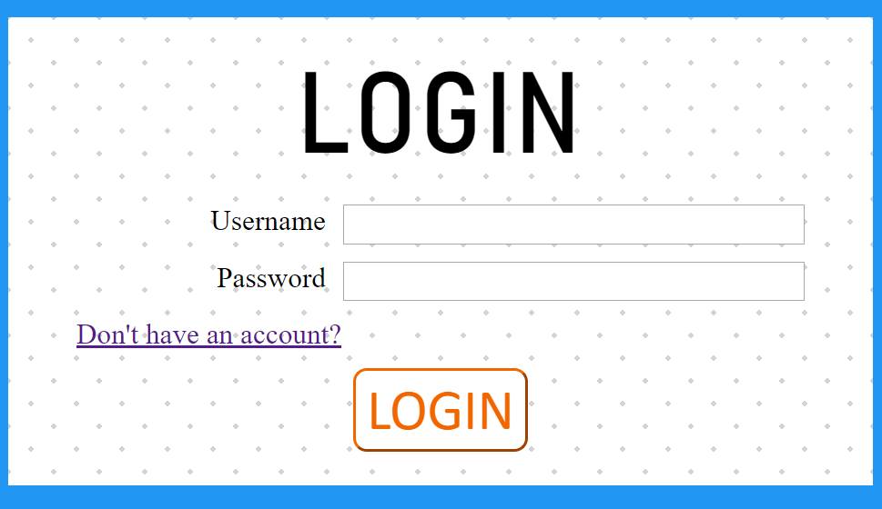
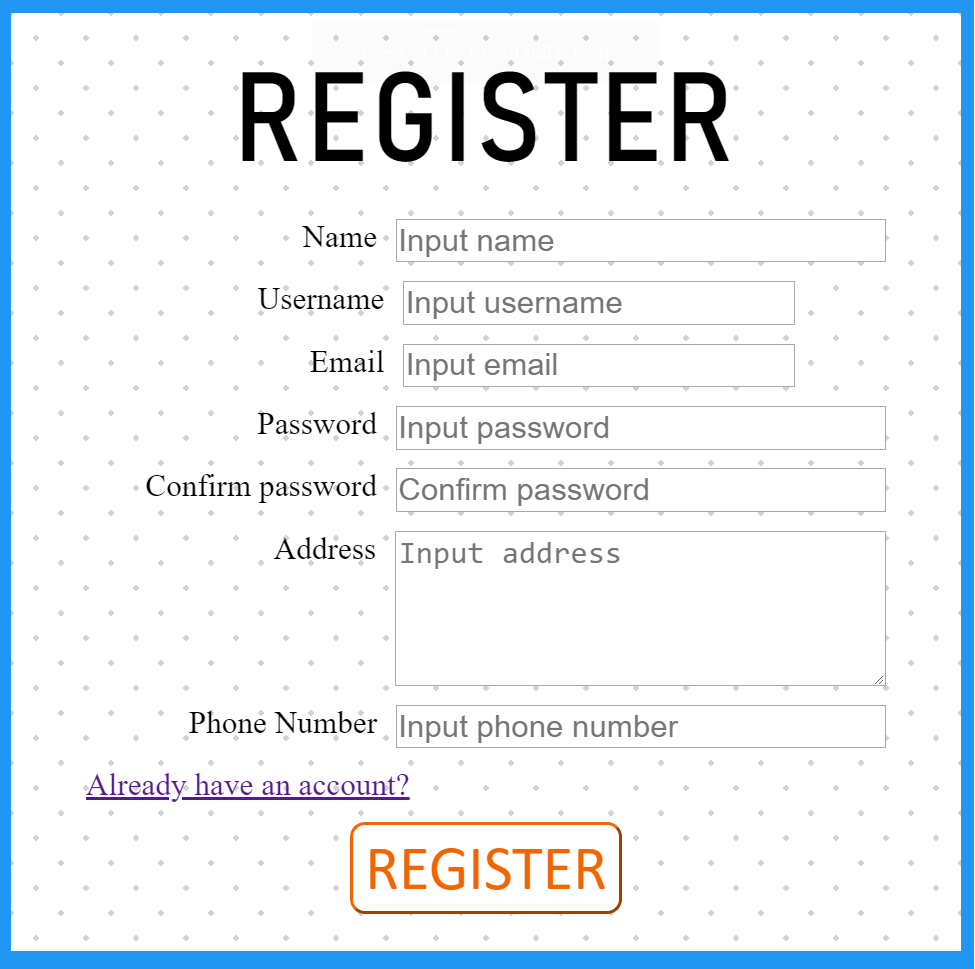
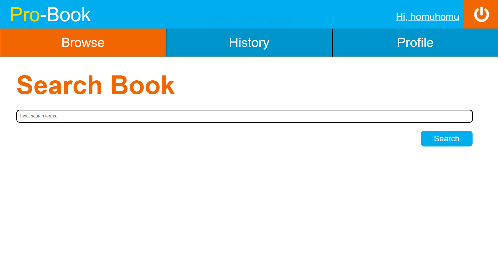
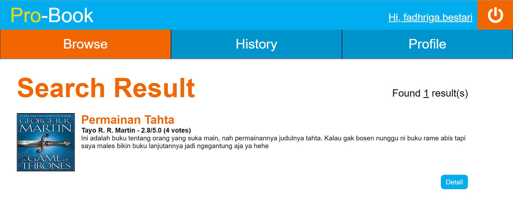
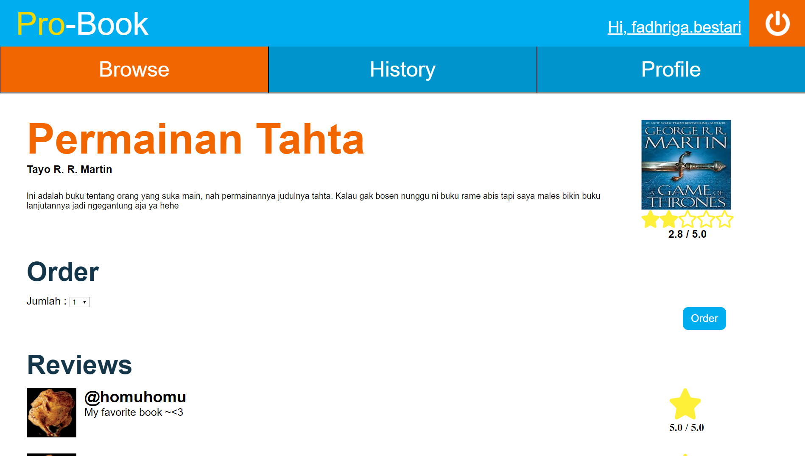
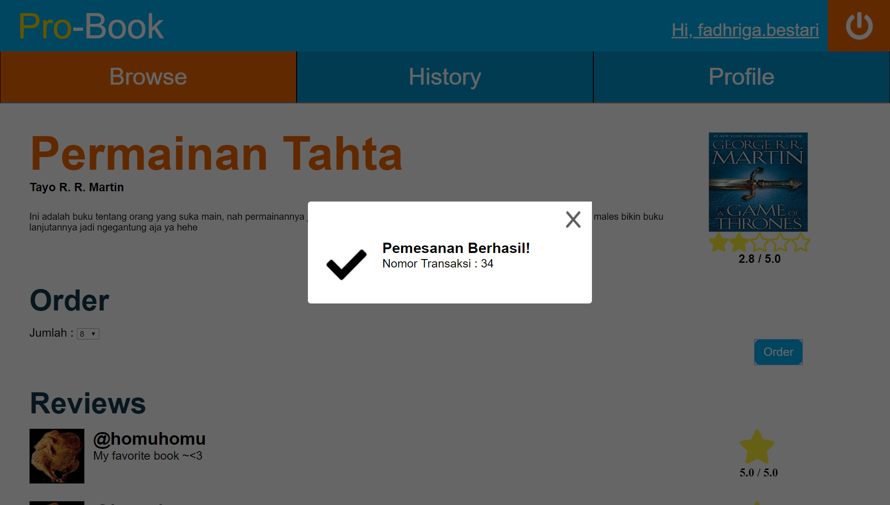
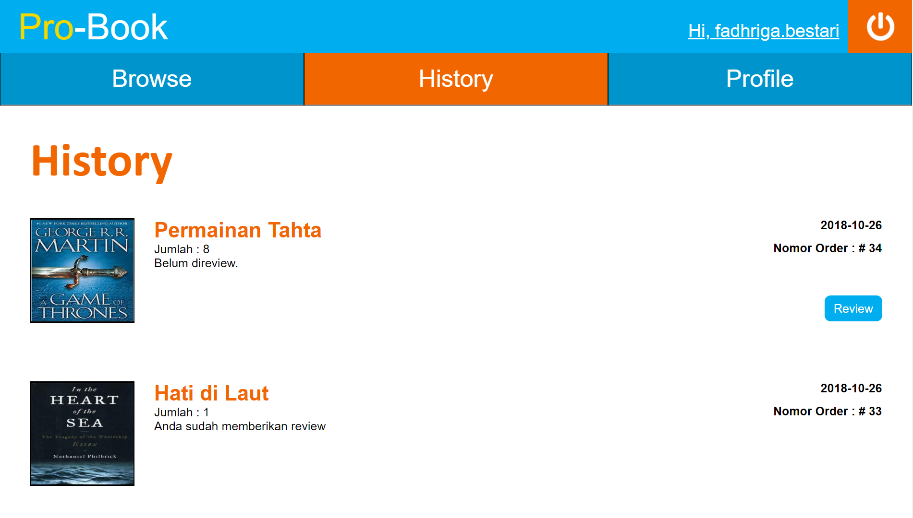
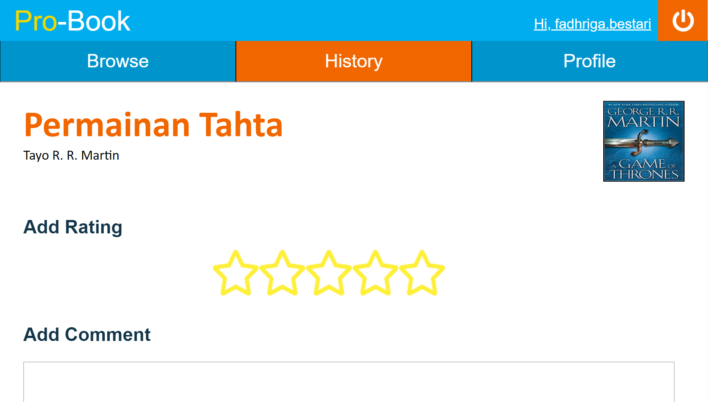
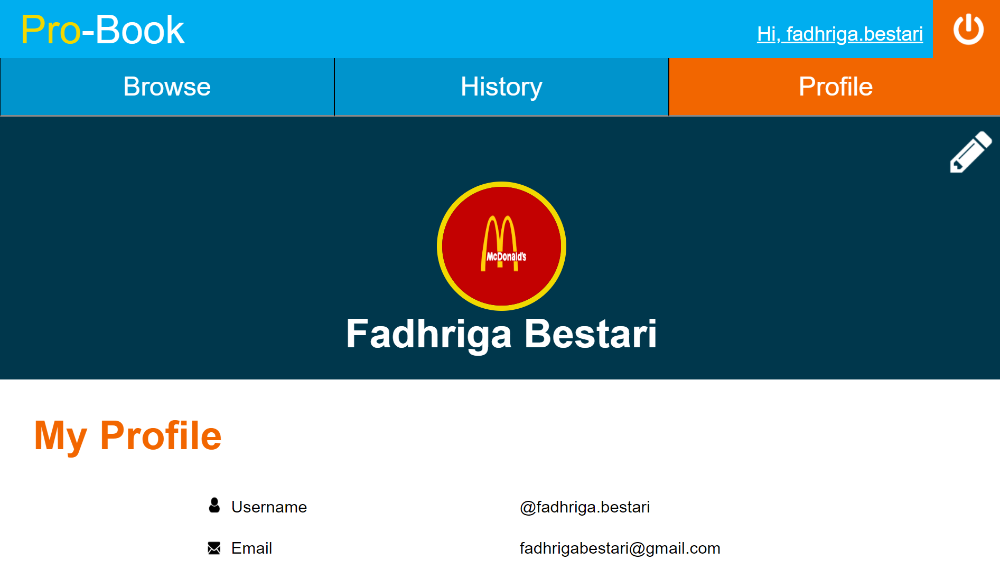
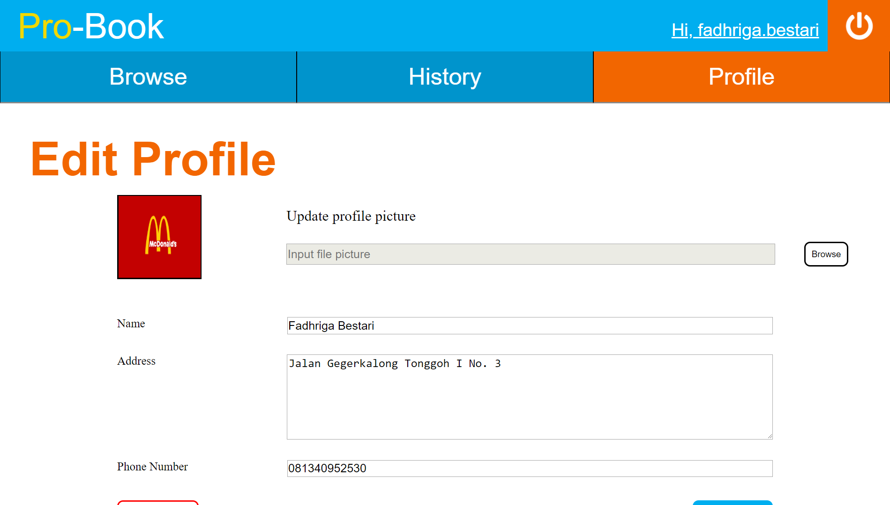

# Tugas 1 IF3110 Pengembangan Aplikasi Berbasis Web

Website Toko Buku Pro-Book

## Spesifikasi

### Login

Anda harus melakukan login terlebih dahulu agar dapat menggunakan aplikasi. Pengguna yang ingin mengakses laman selain login sebelum melakukan proses *authentication* akan di-*redirect* ke laman login.

### Register

Anda dapat mendaftarkan diri terlebih dahulu jika belum memiliki akun. Beberapa hal yang perlu diperhatikan :

- Username memiliki panjang maksimal 20 karakter dan unik
- Email harus unik
- Phone number memiliki panjang minimal 9 karakter dan maksimal 12 karakter
### Search-Books

Search-Books merupakan halaman utama yang ditampilkan setelah Anda *login* secara berhasil. Jika sebelum login Anda mengakses laman lain tanpa *authentication*, Anda akan di-*redirect* ke laman tersebut .

> Anda dapat memasukan '%' sebagai *search query* untuk memeriksa semua buku yang tersedia pada toko kami.

### Search-Result

Pada Search-Result, ditampilkan daftar buku dan jumlah hasil pencarian. Pada tiap entri buku ditampilkan judul, penulis, gambar, potongan sinopsis, serta rating dari buku tersebut. Jika tombol detail ditekan, pengguna akan dibawa ke halaman Book-Detail dari buku yang bersangkutan.

### Book-Detail

Pada laman ini, ditampilkan detail buku yang terdiri dari judul, penulis, gambar, rating, serta komentar dan rating dari user lain.

Setelah proses pemesanan selesai dilakukan, akan muncul notifikasi pada browser Anda yang menyatakan apakah transaksi berhasil diproses atau tidak.

### History

Pada halaman ini, ditampilkan daftar buku yang sudah pernah dipesan oleh pengguna, diurutkan berdasarkan waktu pemesanan dengan pesanan paling baru merupakan entri paling atas.

Pada tiap entri pada history, terdapat tombol review. Jika tombol review ditekan, pengguna akan dibawa ke halaman Review. Jika Anda sudah memberikan review untuk order tersebut, tombol review akan hilang dari entri yang bersangkutan.

### Review

Pada halaman ini, pengguna dapat memberikan review untuk buku yang dipesan berupa rating dan komentar. Review yang diberikan dari halaman ini akan muncul pada halaman Book-Detail dari buku yang di-review. Setelah selesai, Anda akan dibawa kembali ke halaman History.

### Profile

Pada halaman ini, ditampilkan nama lengkap, username, email, alamat, nomor telepon, dan foto profil. Pada bagian kanan atas terdapat tombol edit, jika pengguna menekan tombol tersebut, Anda akan dibawa ke halaman Edit-Profile.

### Edit-Profile

Pada halaman ini, Anda dapat mengubah nama yang ditampilkan, alamat, nomor telepon, dan foto profil.

Pada bagian bawah halaman, terdapat tombol Back dan Save. Jika tombol Back ditekan, Anda kembali ke halaman Profile tanpa mengubah informasi profilnya. Jika tombol save ditekan, nama dan alamat pengguna akan diganti sesuai input field, dan Anda dibawa ke halaman Profile.

### Pembagian Tugas

**Tampilan**

1. Login : 13516067
2. Register : 13516067 , 13516103
3. Search-Books : 13516154
4. Search-Result : 13516154, 13516103
5. Book-Detail : 13516154
6. History : 13516067
7. Review : 13516067
8. Profile : 13516154
9. Edit-Profile : 13516154

**Fungsionalitas**

1. Login :  13516103, 13516154
2. Register :  13516103, 13516154
3. Search-Books : 13516154
4. Search-Result : 13516103, 13516154
5. Book-Detail : 13516154
6. History : 13516067
7. Review : 13516067
8. Profile : 13516154
9. Edit-Profile: 13516103, 13516154
10. Routing, Authentication : 13516103
11. Database: 13516067, 13516103, 13516154

## About

Dinda Yora Islani - 13516067

Gerardus Samudra Sembiring - 13516103

Muhammad Fadhriga Bestari - 13516154
